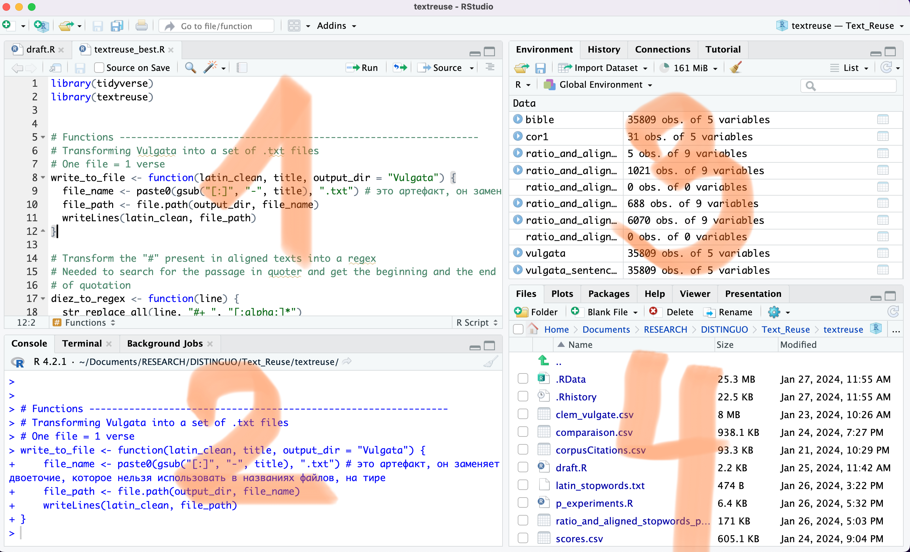

```{r setup, include=FALSE}
knitr::opts_chunk$set(echo = FALSE)
```

## Plan du cours

-   Session 1 : Intro à la textométrie et à R. Découverte d'interface de
    Rstudio. Principes de base
-   Session 2 : Principes de base-2. Manipulation de textes avec R
-   Session 3 : Le traitement automatique du langage naturel (TAL / NLP)
-   Session 4 : Analyse de fréquence
-   Session 5 : Analyse de sentiments
-   Session 6 : Topic modeling
-   Session 7 : L'analyse en composantes principales (PCA)
-   Session 8 : Stylométrie

## Qu'est-ce que R ?

-   Langage de programmation interprété (pas un logiciel !) ;
-   Gratuit, open-source, et disponible sur plusieurs plateformes ;
-   Très efficace pour l'analyse de données ;
-   Ainsi que pour les visualisations ;
-   En développement et amélioration continus (grace à la communauté
    mondiale d'utilisateurs et de développeurs).

R est conçu spécifiquement **pour le traitement des données statistiques** et la création de graphiques. Il a vu le jour en 1993, créé par **R**oss Ihaka et **R**obert Gentleman au département de statistiques de l'université d'Auckland (Nouvelle Zealand), développé par des statisticiens, pour des statisticiens. Par conséquent, il s'avère particulièrement adapté à l'analyse des données, à l'informatique statistique et à l'apprentissage automatique. En raison de ces atouts, il jouit d'une grande popularité dans le monde scientifique.

## Qu'est-ce que RStudio ?

Un environnement de développement intégré (IDE).

## Prise en main de RStudio



1.  l'éditeur de code (pour écrire des scripts) ;

2.  la console ;

3.  l'environnement, l'historique ;

4.  les fichiers, les graphiques, l'aide.

Dans **la console**, on écrit une commande et l'exécute en appuyant sur
**Entrée**. Parfois, après avoir exécuté la commande, on voit certains
résultats apparaitre dans le même quadrant. Si on tappe la flèche vers
le haut du clavier (▲), on peut afficher les commandes précédentes dans
la console. C'est très pratique pour exécuter ces commandes avec de
légères modifications. 

Dans **l'éditeur de code**, pour exécuter une
commande, il faut séléctionner la ligne et faire **Ctrl + Entrée**
(Cmd + Entrée sur mac). On peut sélectionner et exécuter plusieurs
commandes à la fois, voire toutes les commandes d'un script. Une fois
qu'on a exécuté une commande (ou plusieurs commandes), les lignes de
code correspondantes apparaîtront dans la console.

Il est généralement pratique d'utiliser la console pour calculer quelque
chose rapidement, tandis que les scripts sont plus pratiques pour
travailler avec de longues commandes et pour sauvegarder le code écrit
en vue d'un travail ultérieur.

Dans **l'environnement et l'historique** on peut voir les
objets. Ce champ se met automatiquement à jour au fur et à mesure
qu'on exécute des lignes de code et qu'on crée de nouveaux objets.
Il y a également un onglet avec l'historique de toutes les commandes qui
ont été exécutées.

**Les graphes et les fichiers**. On trouve ici un petit gestionnaire de
fichiers, les graphes, les bibliothèques installées et l'aide sur les
fonctions.

## Prise en main - les mathématiques simples

R est un langage de programmation qui est souvent utilisé pour l'analyse
de données et les calculs statistiques. Donc R peut être utilisé comme
une calculatrice !

```{r addition}
20+5
```

```{r soustraction}
45890-1298
```

```{r multiplication}
12*6
```

```{r division}
35/7 # division
```

```{r division entière}
13 %/% 3 # division entière
```

Si vous insérez dans votre code un fragment qui ne doit pas être
exécuté - par exemple, vous voulez commenter quelque chose - mettez
**\#** avant ce texte et commencez le code par la ligne suivante.

```{r exponentiation}
2^6 # exponentiation
```

## Les objets (\~variables)

En programmation avec R, l'une des notions fondamentales est
**l'assignation de valeurs aux objets**. Pour cela, on utilise
généralement le symbole \<- (bien qu'il soit aussi possible d'utiliser
=, même si cette pratique est moins courante). Pour faciliter l'écriture
de \<-, un raccourci clavier existe : Alt + - (Option + -).

La structure de l'assignation est simple :

-   À droite du \<-, on va placer **la valeur à assigner** ou une
    expression dont le résultat sera stocké ;
-   À gauche du \<-, on indique **le nom** qu'on souhaite donner à
    l'objet.

### Les noms d'objets

Concernant les noms d'objets, il y a quelques règles à respecter :

-   Ils peuvent inclure des lettres, des chiffres, des points (.) ou des
    tirets bas (\_) ;
-   Ils sont "case sensitive" (Un_Objet != un_objet) ;
-   Ils doivent commencer par une lettre ou un point suivi d'une lettre
    (et non d'un chiffre !) ;
-   Évitez les [mots réservés par
    R](https://stat.ethz.ch/R-manual/R-devel/library/base/html/Reserved.html)
    et les caractères spéciaux comme les espaces ou des accents.

### Utilisation d'objets

On peut effectuer les mêmes opérations mathématiques sur les objets
que sur les chiffres :

```{r objets}
mon_objet <- 100
150 - mon_objet
```

Au moment d'assigner une valeur à un objet, rien ne se passe dans le
terminal ! Mais, une fois un objet assignée, il apparaît dans l'onglet
«Environnement» de RStudio, permettant un suivi facile de nos objets et
de leurs valeurs.

### Les types d'objets

Nous pouvons enregistrer non seulement des chiffres, mais aussi, par
exemple, du texte dans l'objet :

```{r objet_text}
nom <- 'yatsyk'
```

En assigant une valeur à un objet, l'objet acquiert un type («class» en anglais), celui de la valeur.

## Les types de données

Les principaux types de données qu'on va voir sont les suivants :

- nombre entier (integer) ;
- nombre à virgule flottante (numeric, également appelé double, c'est-à-dire nombre à double précision) ;
- chaîne de caractères (character) ;
- variable logique (logical) ;
- variable catégorielle (factor).

Pour imprimer le type de l'objet dans le terminale, on écrit class(NOTRE OBJET).
```{r class}
class(mon_objet)
class(nom)
```

-   mon_objet est de type : «numeric» ;
-   nom est de type : «character».

Mais qu'est-ce que la commande «class» que nous venons d'utiliser ?
```{r}
class(class)
```

## Les fonctions

En R, une fonction est un ensemble d'instructions conçu pour effectuer
une tâche spécifique. En règle générale, **une fonction est composée de
quelques caractères alphabétiques et suivie par des parenthèses**. Nous
fournissons des données en entrée (entre les parenthèses), puis certains
calculs ont lieu dans ces fonctions, qui renvoient d'autres données en
réponse (la fonction peut également créer un fichier, faire un graphique
etc). On peut considérer les fonctions comme des verbes et les arguments comme des compléments ou des compléments circonstanciels. En d'autres termes, une fonction répond à la question «faire quoi ?» et ses arguments répondent aux questions «par rapport à quoi ?» et «comment ?»

Voici, par exemple, la fonction permettant d'extraire la racine carrée :

```{r racine carrée}
sqrt(4)
```

Pour voir des arguments requis par une fonction, il faut appeler **help**. Pour ce faire, il suffit de mettre un point d'interrogation **devant le nom de la fonction** :

```{r help}
?sqrt()
```

Supprimez la parenthèse fermée et exécutez ce code et observez ce qui est imprimé dans la console. Comparez le résultat avec l'exécution du code de la ligne 194.

```{r}
sqrt(4)
```

Au niveau de la console : 

-   \> apparaît automatiquement au début de chaque nouvelle ligne ;
-   \+ apparaît au début de ligne si la ligne précédente est incomplète.

## Prise en main - création du script

Un script est un ensemble de commandes. R interprète et exécute chaque
commande, les unes après les autres. Chaque commande passe par la
console.

A vous de jouer ! Cliquez sur le bouton "Nouveau fichier" en haut à
gauche pour créer un script R. Ensuite, appuyez sur Ctrl + S (Cmd + S),
donnez un nom à votre fichier et enregistrez-le dans le dossier S_1.

Votre tâche consiste à :

-   créer un objet et à lui attribuer une valeur numérique ;

-   créer un autre, égale à la racine carrée du premier ;

-   imprimer le deuxième objet

N'oubliez pas que l'aspect essentiel des expériences scientifiques réside dans leur **reproductibilité**. Par conséquent, il est impératif de prévoir l'inclusion du code utilisé dans la rédaction de vos publications. Il est tout aussi crucial d'expliquer en détail les actions que vous avez entreprises et les raisons qui motivent ces choix, afin que vos collègues puissent parfaitement appréhender votre démarche. **Les commentaires dans votre code** sont un outil indispensable pour atteindre cet objectif.

```{r}
a <- 16
b <- sqrt(a) # b = racine carrée de a
b # montre-moi b
```
