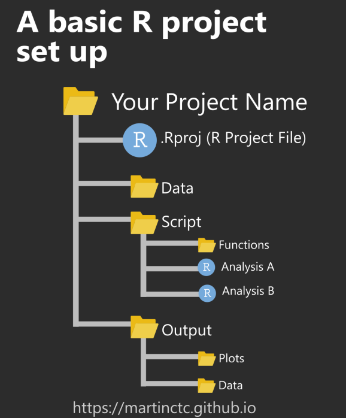
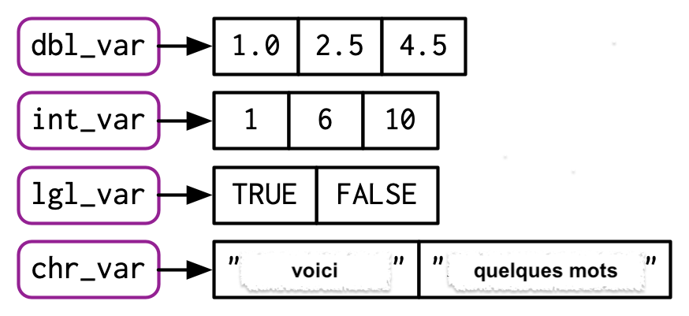

```{r setup, include=FALSE}
knitr::opts_chunk$set(echo = FALSE)
options(repos = c(CRAN = "https://cran.rstudio.com/"))
```
# Importation et exportation de données

L'analyse en R commence toujours par **l'importation de données**. Mais **où** va-t-on les importer ?

## La répertoire de travail

La «répertoire de travail» (ou «working directory») dans R est le dossier sur votre ordinateur où R cherche et sauvegarde les fichiers par défaut. Lorsque vous lancez R ou RStudio, il démarre avec un répertoire de travail spécifique, qui est généralement le dossier où se trouve votre script R.

Pour savoir dans quel répertoire de travail on se trouve :
```{r}
getwd()
```

Pour changer le répertoire :
```{r}
setwd("/Users/sy/Documents/GitHub/textometry_Paris-Saclay/S_2") 
# à remplacer par le PATH vers le dossier désiré. N'oubliez pas les guillemets !
```

Pour copier le chemin d'un fichier, sélectionner le fichier, puis **Option + Command + C** (Mac) ou **Ctrl + Shift + C** (Windows).

`/Users/sy/Documents/GitHub/textometry_Paris-Saclay/S_2` est le chemin de dossier **absolu**. Il s'agit de l'adresse exacte du fichier sur mon ordinateur.

La création d'un **projet RStudio** présente un certain nombre d'avantages en termes de navigation entre les fichiers :
- Lorsque vous travaillez dans un projet R, tous les chemins de fichiers sont définis **relativement au répertoire de travail** du projet. Cela signifie que vous pouvez utiliser des chemins de fichiers courts et simples sans avoir à spécifier un chemin absolu.
- Par conséquent, votre projet devient plus **portable**. Vous pouvez le déplacer vers un autre ordinateur ou le partager avec d'autres personnes sans avoir à reconfigurer les chemins de fichiers.

{width="50%"}

Il est donc fortement recommandé de créer un projet pour chaque étude effectuée avec R en respectant l’arborescence présentée sur l’image ci-dessus.

## Manipulation de données tabulaires

Pour lire des données tabulaires, utilisez `read.table()` (pour .tab et .tsv) et `read.csv()` (pour .csv).

### tsv, tab

```{r}
quotes <- read.table("../data/quotes.tsv", sep = "\t", header = TRUE)
head(quotes[1])
```

La fonction `head()` est utilisée pour afficher les premières lignes d'un objet en R. Par défaut, elle retourne **les six premières lignes**. L'opération de sous-ensemble `[1]` indique à R de prendre uniquement la première colonne.

```{r}
quotes[3,2] # afficher la troisième ligne de la deuxième colonne
quotes[6,1] # afficher la sixième ligne de la première colonne
quotes[3:5, 1] # afficher les lignes trois à cinq de la première colonne
```

**Exercice : trouver et afficher une citation de Sénèque, Virgile, Plutarque, Bouddha, Confucius.** 

### csv

`read.csv()` fait la meme chose, mais définit automatiquement les paramètres pour lire les fichiers .csv.

## Manipulation de données textuelles

### txt

Utilisez `readLines()` pour lire des fichiers texte. Cette fonction est utilisée pour lire du texte à partir d'une source de données (comme un fichier) et renvoie un vecteur dont chaque élément représente une ligne de texte du fichier. 
L'argument `n` détermine le nombre de lignes à lire. NB! **L'indexation en R commence à 1** (tandis que celle de Python commence à 0).

```{r}
genesis <- readLines(con = "../data/Genesis.txt")
genesis_beginning <- readLines(con = "../data/Genesis.txt", n=2)
```

Pour voir le contenu d'un objet créé, il suffit de taper son nom dans la console et d'appuyer sur la touche Entrée.

**Exercice : créer un objet ne contenant que le premier chapitre du livre de la Genèse.**

### doc

**Il est préférable d'éviter les fichiers Word**, en les convertissant en dehors de R en `.txt`. Sinon, il faut installer la bibliothèque `officer` et utiliser la fonction `read_docx()`.

```{r}
# Installer et charger la bibliothèque `officer`
install.packages("officer")
library(officer)
# Lire le fichier .docx
doc <- read_docx("../data/plano_carpini_rus.docx")
# Extraire le contenu du document
texte <- docx_summary(doc)
# Afficher le contenu
# print(texte)
```

### pdf

**Il est préférable d'éviter les fichiers PDF** aussi. Si cela est indispensable, il convient d'utiliser la bibliothèque `pdftools` pour l'importation.

```{r}
library(pdftools)
article <- pdf_text(pdf = "../data/Hegghammer.pdf")
meta <- pdf_info(pdf = "../data/Hegghammer.pdf")
meta$keys$Author
```

En R, le symbole `$` est utilisé pour **accéder aux éléments** d'une liste ou aux colonnes d'un dataframe **par leur nom**. Cela permet de sélectionner une colonne spécifique d'un dataframe ou un élément spécifique d'une liste en utilisant le nom de cet élément.

Au lieu de numéroter les colonnes de `quotes`, nous pourrions simplement les appeler par leur nom !

```{r}
quotes$quote
```

**Exercice : afficher ligne 30 de la colonne "source".**

Pour reconnaître un fichier PDF qui n'a pas été OCRsé, il faut installer la bibliothèque `tesseract` et télécharger la langue requise.

```{r}
library(tesseract)
tesseract_download("ita")
# Astuce : appuyez sur la touche Tab après avoir saisi le nom du dossier "data"
article_ocr <- pdf_ocr_text("../data/Agiografi_e_notai.pdf", pages = 2, language = "ita")
cat(article_ocr)
```


### images

Les images peuvent également être reconnues par `tesseract`, mais la précision de la transcription dépend à la fois de la qualité de l'image et de la police de caractères.

```{r}
tesseract_download("fra")
fra <- tesseract::tesseract("fra")
text_david <- tesseract::ocr("../data/Nicolay_Nicolas_11.jpeg", engine = fra)
cat(text_david)
```

# Structure de données

Nous avons déjà constaté qu'il existe plusieurs types de données dans R, à savoir :
- Nombre entier (integer) ;
- Nombre à virgule flottante (numeric, également appelé double, c'est-à-dire nombre à double précision) ;
- Chaîne de caractères (character) ;
- Variable logique (logical) ;
- Variable catégorielle (factor).

Examinons maintenant les structures qu'ils peuvent former.

## Vecteurs

Les vecteurs sont les objets les plus communs en R. Il s'agit d'une **collection d'éléments à une dimension**. Les éléments contenus dans un vecteur doivent nécessairement être **de même type**. Lorsque on a créé des objets contenant un numérique ou une chaîne de caractère, R a stocké l’information sous la forme d’un vecteur de longueur 1 (vecteur contenant un seul élément).

```{r}
lgl_var <- c(TRUE, FALSE)
int_var <- c(1L, 6L, 10L)
dbl_var <- c(1, 2.5, 4.5)
chr_var <- c("voici", "quelques mots")
```

{width="50%"}

Pour obtenir la classe et la longueur du vecteur :
```{r}
class(chr_var)
length(dbl_var)
```

Si on essaye de combiner des données de différents types dans un seul vecteur, elles seront forcées au même type :

```{r}
x <- c(TRUE, 1, 3, FALSE)
x # qu'arrive-t-il aux valeurs logiques ?
```
```{r}
y <- c(1, 5, "Emma", "Owen")
y # qu'arrive-t-il aux valeurs numeriques ?